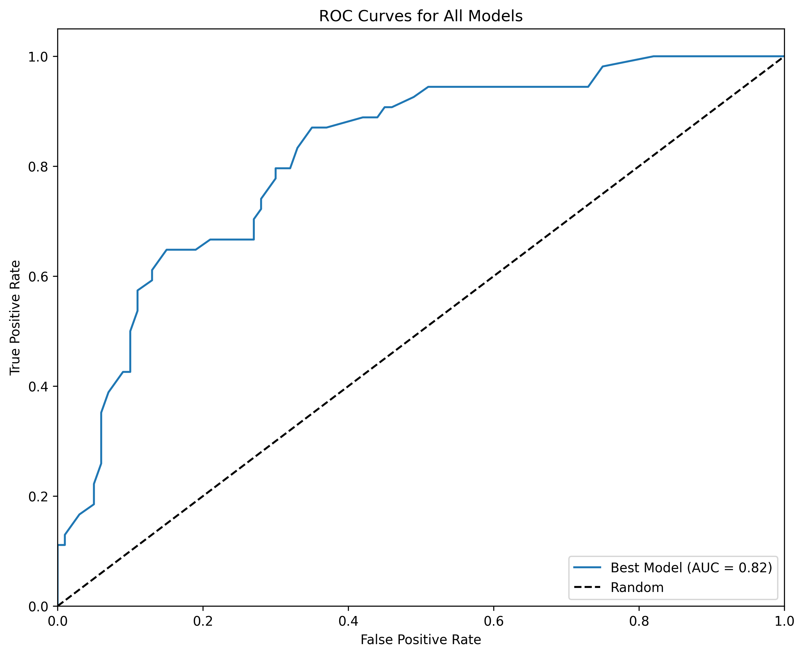

# Diabetes Prediction Using Machine Learning

A comprehensive machine learning project for predicting diabetes risk using the Pima Indians Diabetes Dataset. This project includes data exploration, model training, evaluation, and a user-friendly web application for predictions.

## 🚀 Features

- **Data Exploration**: Comprehensive EDA with visualizations
- **Model Training**: Three ML models (Logistic Regression, Random Forest, SVM)
- **Model Evaluation**: Performance comparison with metrics and ROC curves
- **Web Application**: Interactive Streamlit app for diabetes prediction
- **Risk Analysis**: Detailed risk factor assessment
- **Report Generation**: Downloadable prediction reports

## 📊 Dataset

**Pima Indians Diabetes Dataset**
- **Source**: National Institute of Diabetes and Digestive and Kidney Diseases
- **Features**: 8 medical predictor variables
- **Target**: Diabetes outcome (0=Non-Diabetic, 1=Diabetic)
- **Samples**: 768 instances

### Features:
1. Pregnancies - Number of times pregnant
2. Glucose - Plasma glucose concentration (mg/dL)
3. BloodPressure - Diastolic blood pressure (mm Hg)
4. SkinThickness - Triceps skin fold thickness (mm)
5. Insulin - 2-Hour serum insulin (mu U/ml)
6. BMI - Body mass index
7. DiabetesPedigreeFunction - Diabetes pedigree function
8. Age - Age in years

## 🛠 Installation

### Prerequisites
- Python 3.8+
- pip package manager

### Setup Instructions

1. **Clone the repository** (if applicable) or navigate to the project directory

2. **Create a virtual environment** (recommended):
   ```bash
   python -m venv diabetes_env
   source diabetes_env/bin/activate  # On Windows: diabetes_env\Scripts\activate
   ```

3. **Install dependencies**:
   ```bash
   pip install -r requirements.txt
   ```

4. **Prepare the dataset**:
   - Place `diabetes.csv` in the `data/` folder
   - If you don't have the dataset, the training script will download it automatically

## 📈 Usage

### 1. Data Exploration
```bash
python src/data_exploration.py
```
- Generates visualizations in `visualizations/` folder
- Displays basic statistics and data insights

### 2. Train Models
```bash
python src/train_model.py
```
- Trains three ML models on the dataset
- Saves the best model and scaler to `models/` folder
- Displays performance metrics for each model

### 3. Evaluate Models
```bash
python src/evaluate_model.py
```
- Generates confusion matrices and ROC curves
- Compares all models side-by-side
- Saves evaluation plots to `visualizations/` folder

### 4. Run Web Application
```bash
streamlit run app.py
```
- Opens interactive web app in browser
- Input medical features and get diabetes risk prediction
- Download detailed prediction reports

## 📊 Model Performance

| Model | Accuracy | Precision | Recall | F1-Score |
|-------|----------|-----------|--------|----------|
| Logistic Regression | 0.7532 | 0.7143 | 0.5556 | 0.6250 |
| Random Forest | 0.7403 | 0.6667 | 0.6111 | 0.6377 |
| SVM | 0.7468 | 0.6818 | 0.5833 | 0.6286 |

*Note: Performance may vary based on random seed and data preprocessing*

## 🏗 Project Structure

```
diabetes-prediction/
│
├── app.py                          # Streamlit web application
├── requirements.txt                # Python dependencies
├── README.md                       # Project documentation
│
├── src/
│   ├── train_model.py             # Model training script
│   ├── data_exploration.py        # EDA and visualization
│   └── evaluate_model.py          # Model evaluation
│
├── models/                        # Trained models and scalers
│   ├── diabetes_model.pkl
│   └── scaler.pkl
│
├── data/                          # Dataset
│   └── diabetes.csv
│
└── visualizations/                # Generated plots and charts
    ├── outcome_distribution.png
    ├── correlation_heatmap.png
    ├── feature_distributions.png
    ├── confusion_matrix_*.png
    ├── roc_curves.png
    └── feature_importance.png
```

## 🔧 Technical Details

### Data Preprocessing
- Handled zero values by replacing with median values
- Feature scaling using StandardScaler
- 80-20 train-test split with stratification

### Models Used
1. **Logistic Regression**: Baseline linear model
2. **Random Forest**: Ensemble method for better accuracy
3. **SVM**: Support Vector Machine with RBF kernel

### Evaluation Metrics
- Accuracy, Precision, Recall, F1-Score
- Confusion Matrix
- ROC Curves and AUC
- Feature Importance (Random Forest)

## 🌐 Web Application Features

- **Interactive Input**: Sliders for all medical features
- **Real-time Prediction**: Instant diabetes risk assessment
- **Probability Display**: Shows prediction confidence
- **Risk Analysis**: Identifies key risk factors
- **Report Download**: Generate and download prediction reports
- **Professional UI**: Clean, medical-themed interface

## 📝 Screenshots

### Web Application Interface


### Model Performance Comparison


### Feature Correlation Heatmap


## 🤝 Contributing

1. Fork the repository
2. Create a feature branch (`git checkout -b feature/AmazingFeature`)
3. Commit your changes (`git commit -m 'Add some AmazingFeature'`)
4. Push to the branch (`git push origin feature/AmazingFeature`)
5. Open a Pull Request

## 📄 License

This project is licensed under the MIT License - see the [LICENSE](LICENSE) file for details.

## ⚠️ Disclaimer

This tool is for educational and research purposes only. The predictions are based on machine learning models trained on historical data and should not be used as a substitute for professional medical advice, diagnosis, or treatment. Always consult with qualified healthcare professionals for medical decisions.

## 📞 Contact

For questions or feedback, please open an issue in the repository.

---

**Built with ❤️ using Python, Scikit-learn, and Streamlit**
